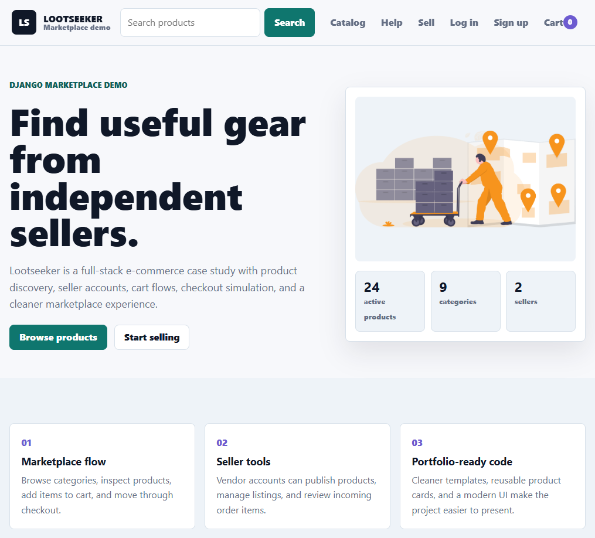

# Lootseeker E-Commerce

Lootseeker is a full-stack Django marketplace case study focused on product discovery, seller accounts, cart flows, checkout simulation, and a responsive storefront experience.

The project started as an e-commerce learning build and was later modernized into a portfolio-ready demo with cleaner templates, a stronger visual system, safer configuration, and a more reliable cart/checkout path.

## Preview



## What it shows

- Django app structure with separate `core`, `store`, and `userprofile` apps.
- Product catalog, category pages, product detail pages, and search.
- User accounts, seller profiles, and a "my store" area for managing listings.
- Session-based cart with quantity updates, removal, and persistent cart state.
- Checkout flow with optional Stripe integration and a no-key demo fallback.
- Reusable templates for product cards and marketplace sections.
- Responsive HTML/CSS/JavaScript without a frontend build step.
- Environment-based settings for secrets, debug mode, allowed hosts, and Stripe keys.

## Tech stack

- Python
- Django
- SQLite
- HTML templates
- CSS
- JavaScript
- Optional Stripe Checkout

## Case study

### Problem

Small marketplace experiences need more than a product grid. A useful demo should show how buyers browse, sellers manage products, and the checkout flow behaves when payment keys are not available in a public portfolio environment.

### Solution

Lootseeker now presents itself as a cleaner commerce product demo:

- A modern marketplace homepage with product stats and featured listings.
- Product cards shared across home, category, search, seller, and cart flows.
- Cart behavior that avoids duplicate line issues and supports quantity updates.
- Checkout logic that can use Stripe when keys exist, or complete a demo order locally when they do not.
- Safer project settings using environment variables instead of hard-coded production-style values.

### AI-assisted workflow

The modernization was planned and implemented with AI agent support for code review, template refactoring, UX copy, cart/checkout debugging, and verification. Product direction, final implementation choices, and testing stayed human-led.

### What I would build next

- Admin analytics dashboard for orders, revenue, products, and sellers.
- Seed command for demo data and predictable portfolio screenshots.
- Tests for cart behavior, checkout creation, and seller permissions.
- Deployment setup with production database, media storage, and real Stripe webhooks.
- A public live demo with demo buyer and seller credentials.

## Local setup

From the repository root:

```powershell
cd website
python -m venv .venv
.\.venv\Scripts\Activate.ps1
python -m pip install --upgrade pip
python -m pip install -r requirements.txt
python manage.py migrate
python manage.py runserver
```

Then open:

```text
http://127.0.0.1:8000/
```

## Environment variables

The app can run locally without extra variables. For a more production-like setup, define:

```text
DJANGO_SECRET_KEY=your-local-secret
DJANGO_DEBUG=True
DJANGO_ALLOWED_HOSTS=localhost,127.0.0.1
STRIPE_PUB_KEY=pk_test_...
STRIPE_SECRET_KEY=sk_test_...
```

If Stripe keys are not set, checkout uses the local demo order path so the portfolio flow still works.

## Useful commands

```powershell
cd website
python manage.py check
python manage.py test
python manage.py runserver
```

## Status

Portfolio modernization pass completed: responsive UI, reusable templates, checkout fallback, cart fixes, environment settings, and updated project documentation.
